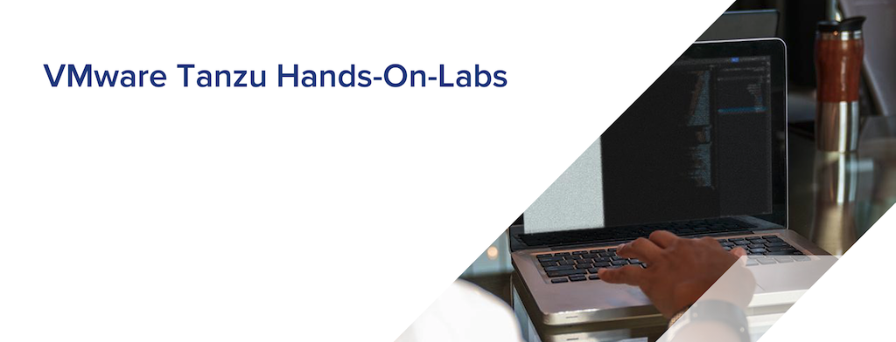

# MSA-HOL
 (Micro Service Architecture Hands-On-Lab)
 

 ## 소개
본 핸즈온 문서는 VMware Tanzu 제품들을 이용해서 Micro Service Architecture를 구성하는 실습에 대한 내용을 포함하고 있습니다.
개발 프레임워크는 Spring Boot를 사용하여 개발하고 이를 Kubernetes위에 서비스로 올리게 됩니다. 이렇게 올려진 서비스들은 외부에서 접근시 Spring Cloud Gateway를 사용하여 API Gateway를 통해 서로 연동이 되게 됩니다. 소스를 build하고 Kubernetes 환경에 배포하기 위한 방법으로 CNB(Cloud Native Buildpack)를 사용해서 쉽게 배포하는 방법에 대해서도 알아봅니다.

## Lab 목표
* Spring Cloud Kubernetes를 작성하는 방법에 대해서 알아봅니다.
* Spring Cloud Gateway의 구성방법과 사용법을 알아봅니다.
* Spring Cloud Discovery 를 이용해서 개발하는 방법에 대해서 알아봅니다.
* CNB(Cloud Native BuildPack)의 사용법에 대해서 알아봅니다.

## 사전 준비사항
* 인터넷 접속 가능한 PC
* Tanzu Kubernetes Grid
* Docker Desktop
* Spring 개발 IDE (본 Lab에서는 Spring Tool Suite 사용)
* SSH Terminal (windows Putty, macOS Terminal 등)

## Hands-On 순서

1. [간단한 Spring App Kubernetes에 배포하기](./spring_deploy_k8s.md)
1. [Spring Cloud Gateway 구성하기](./scg_config.md)
1. [Cloud Native Build Pack으로 쉽게 배포하기](./cnb.md)
