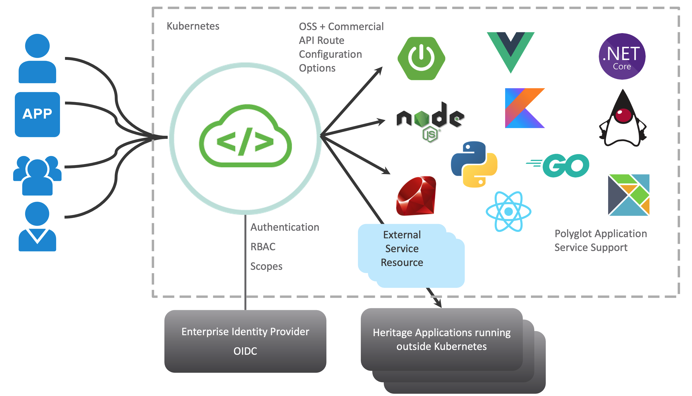

## Spring Cloud Gateway 이용하기

Spring Cloud Gateway는 각각의 Micro Service 로 만든 서비스들을 외부에서 접근할 경우 API Gateway를 사용해서 접근 제어나 부하조절 (rate-limit) 이나 장애차단 (circuit-break)등의 기능을 수행할 수 있습니다. 
이번 Lab에서는 Spring Cloud Way를 구성하고 사용하는 방법에 대해서 알아보고 실습을 해봅니다.

### [1. Spring Cloud Gateway 구성하기](./scg_install.md)
### [2. Spring Cloud Gateway 사용하기](./scg_config.md)
### [3. Spring Cloud Gateway Advanced 기능 활용하기](./scg_advanced.md)