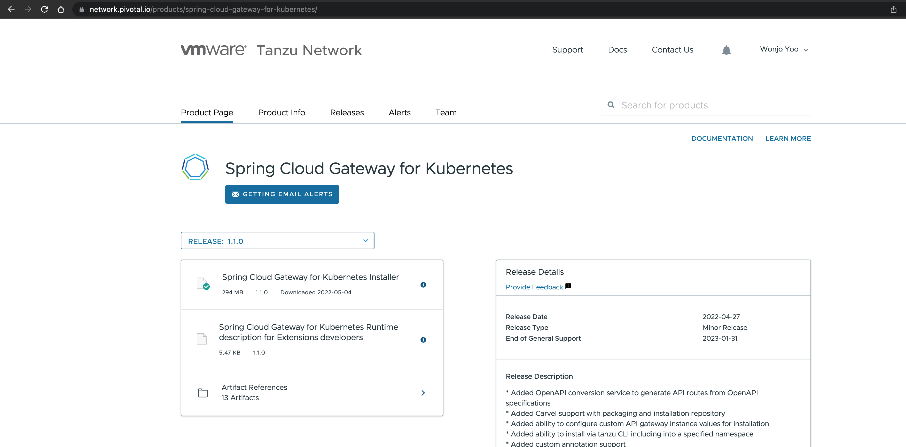

## Spring Cloud Gateway 설치하기
### 1. SCG 다운로드
Spring Cloud Gateway for Kubernetes는 상용 제품으로 VMware 에서 Kubernetes 용 Image를 제공하고 있습니다.
Tanzu Network에 접속해서 파일을 다운로드 받습니다.


### 2. 압축풀기
```
$ tar zxf spring-cloud-gateway-k8s-[VERSION].tgz

$ ls spring-cloud-gateway-k8s-[VERSION]

dashboards/      helm/      images/    scripts/
```
### 3. private registry(harbor)로 이미지 경로 변경하기
제공되는 스크립트를 실행하면 local docker에 우선 load가 되고 private registry(harbor)에 경로가 변경이 되어 push가 되게 됩니다.
아래과 같이 relocate-images.sh를 실행합니다.

```
$ ./scripts/relocate-images.sh <REGISTRY_URL> 
```
Upload가 완료되고 나서 helm/scg-image-values.yaml에 파일이 업데이트 되는데,
<REGISTRY_URL> 이 myregistry.example.com/spring-cloud-gateway 라고 한다면 아래와 같이 변경이 되게 됩니다.

scg-operator:
  image: "myregistry.example.com/spring-cloud-gateway/scg-operator:v[VERSION]"
gateway:
  image: "myregistry.example.com/spring-cloud-gateway/gateway:v[VERSION]"

### 4. namespace 생성하기
이제 namespace를 생성합니다.
```
$ kubectl create ns spring-cloud-gateway
namespace/spring-cloud-gateway created
```

### 5. scg 이미지 배포하기
이제 아래의 스크립트를 실행해서 업로드된 image를 kubernetes에 배포하면 됩니다.
이 과정은 helm 기반의 설치 방식으로 진행이 됩니다.
```
$ ./scripts/install-spring-cloud-gateway.sh --namespace my_namespace_name
```


### 6. scg 설치 확인하기
정상적으로 설치가 되면 Operator가 설치가 되며 아래와 같이 확인이 가능합니다.

```
$ kubectl get all -n spring-cloud-gateway
NAME                                READY   STATUS    RESTARTS   AGE
pod/scg-operator-676fc6d745-fg96r   1/1     Running   0          6d16h
pod/scg-operator-676fc6d745-mb9n4   1/1     Running   0          6d16h

NAME                   TYPE        CLUSTER-IP     EXTERNAL-IP   PORT(S)   AGE
service/scg-operator   ClusterIP   100.67.6.176   <none>        80/TCP    6d16h

NAME                           READY   UP-TO-DATE   AVAILABLE   AGE
deployment.apps/scg-operator   2/2     2            2           6d16h

NAME                                      DESIRED   CURRENT   READY   AGE
replicaset.apps/scg-operator-676fc6d745   2         2         2       6d16h
```

좀 더 자세한 설치방법은 아래의 document를 참고하시면 됩니다.
참고: 
https://docs.vmware.com/en/VMware-Spring-Cloud-Gateway-for-Kubernetes/1.1/scg-k8s/GUID-installation-helm.html

