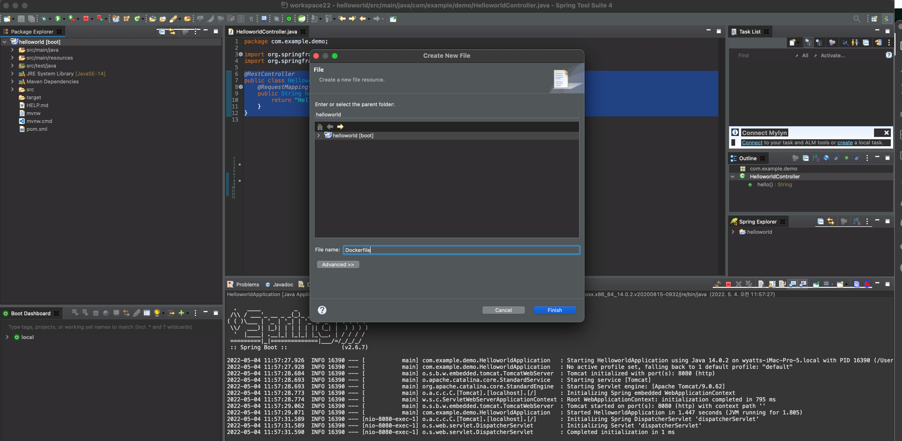
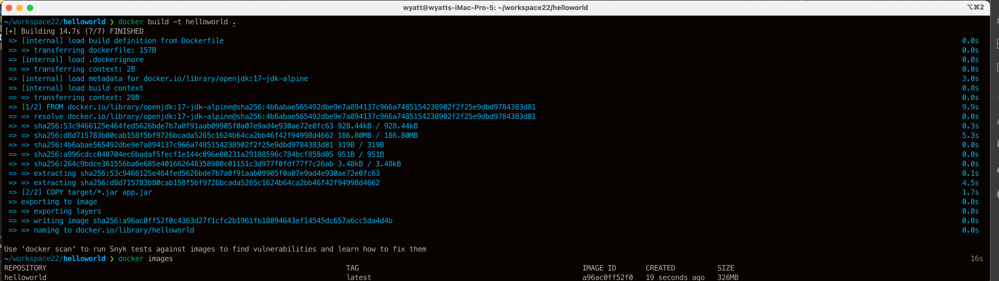
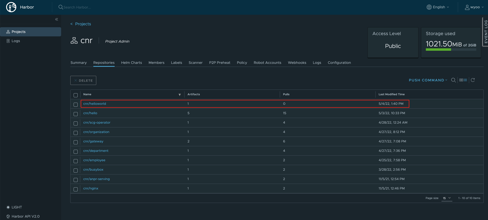

## 사전 준비사항
* Docker Desktop : Local환경에 Docker가 기동되어 있어야 합니다.
* Harbor (Container Registry)

### 1. Container 이미지 생성하기
SpringBoot Project내에 Dockerfile을 생성합니다.


아래의 내용을 넣습니다.

```
FROM openjdk:17-jdk-alpine
ARG JAR_FILE=target/*.jar
COPY ${JAR_FILE} app.jar
ENTRYPOINT ["java","-jar","/app.jar"]
```

### 2. 이미지 build하기
프로젝트 경로로 이동한 후 docker build 명령어를 실행합니다.
docker build -t helloworld .

docker 이미지가 빌드되면 container images 로 생성된 이미지를 확인합니다.



### 2. Container Registry에 올리기
이제 생성된 이미지를 Container registry로 올리는 작업을 수행하기 위해 tag를 만듭니다.
Container Registry가 projects.registry.vmware.com/cnr 라고 할 경우 아래와 같이 수행합니다.

```
docker tag helloworld projects.registry.vmware.com/cnr/helloworld:1.0
```
### 3. tag가 정상적으로 생성이 되었는지 확인합니다.
```
docker images |grep helloworld
helloworld                                                                       latest                                                  a96ac0ff52f0   4 minutes ago   326MB
projects.registry.vmware.com/cnr/helloworld                                      1.0                                                     a96ac0ff52f0   4 minutes ago   326MB
```

### 4. Container Registry에 login을 수행합니다.
```
docker login projects.registry.vmware.com
Authenticating with existing credentials...
Login Succeeded
```
### 5. docker push 명령어로 이미지를 upload 합니다.

docker push projects.registry.vmware.com/cnr/helloworld:1.0
The push refers to repository [projects.registry.vmware.com/cnr/helloworld]
5f70bf18a086: Mounted from cnr/gateway
34f7184834b2: Pushed
5836ece05bfd: Pushed
72e830a4dff5: Pushed
1.0: digest: sha256:618f8b65bbb0be84d34f9110384ebd2ef3dd8800a8e1fd7ba5726ed7fde7d6c7 size: 1157

### 6. Conainer Registry(Harbor)에 정상적으로 이미지가 업로드 되었는지 확인합니다.
Harbor
