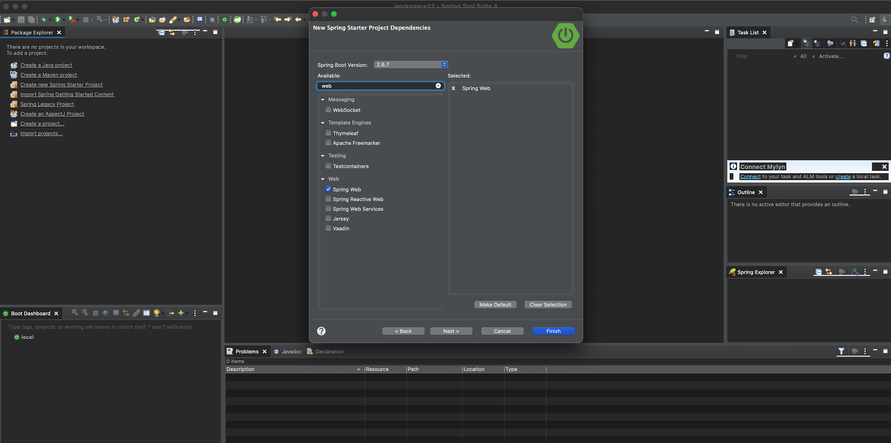
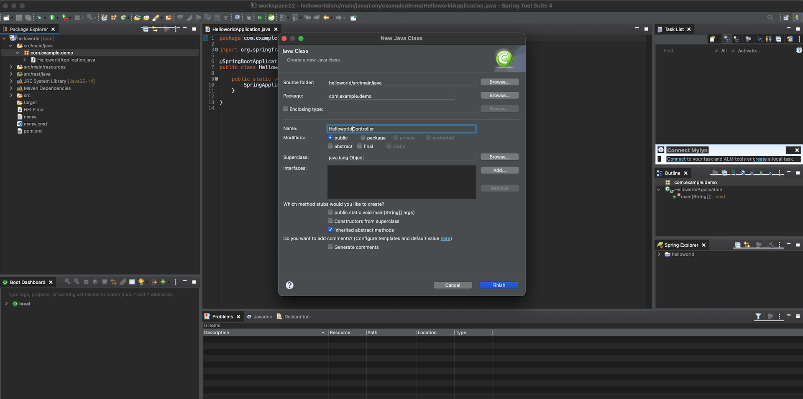

## 간단한 Hello world Spring App 만들기

### 1. JDK 다운로드
본 Lab에서는 JDK17을 사용합니다.
아래의 주소에서 사용할 OpenJDK를 다운로드 받아서 설치합니다.
https://jdk.java.net/archive/

OS에서 JAVA_HOME 환경변수를 설정합니다.

### 2. Spring 개발 환경 준비하기
STS(Spring Tool Suite) 4를 아래의 주소에서 다운로드 받아서 설치합니다.
https://spring.io/tools

설치된 JDK 환경변수가 정상적으로 설정되면 STS 의 Preferences -> Java -> Installed JREs 에 Java SE 17이 나오고 선택되어 있습니다.

### 3. SpringBoot로 간단한 Hello App 만들기
STS(Spring Tool Suite)를 실행 한 후 좌측 Package Explorer에 나오는 'Create a new Spring Starter Project'를 클릭합니다.
이 메뉴가 보이지 않는 경우에는 File -> New -> Spring Starer Project 를 클릭합니다.
이름을 helloworld 라고 하고 Next 버튼을 누릅니다.


web 이라고 검색한 후 spring web을 추가합니다.


프로젝트가 생성이 되면 Controller Class를 생성합니다. New Java Class를 해서 HelloworldController 라고 생성합니다.


아래와 같이 내용을 입력해서 / 로 요청했을때 Hello World가 출력되도록 합니다.
```
@RestController
public class HelloworldController {
	@RequestMapping("/")
	public String hello() {
		return "Hello World";
	}
}
```
파일에 오른쪽 마우스를 눌러 Organize Imports를 합니다.


자동으로 import가 추가되었습니다.


HelloworldAppliation 파일에 오른쪽 마우스를 눌러 실행을 합니다.


http://localhost:8080/ 으로 접속하면 아래와 같이 정상적으로 페이지가 열리게 됩니다.

