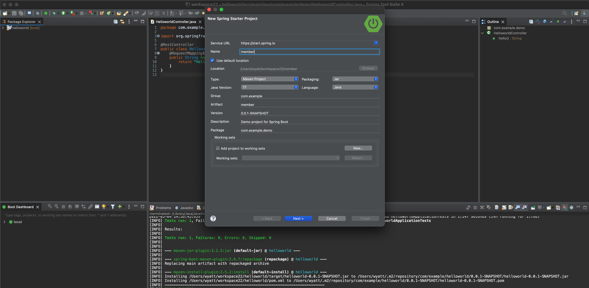
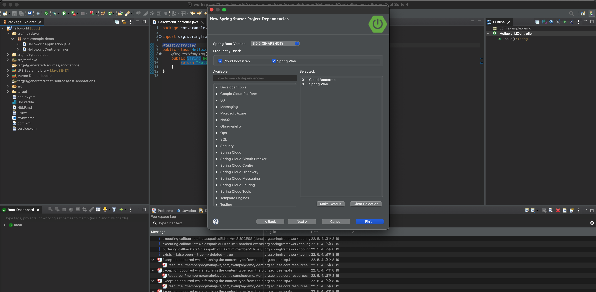
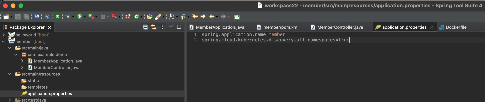

## Kubernetes 에서 Spring으로 다른 서비스 호출 하기
Spring 에서는 Kubernetes(k8s) 와 최적화가 되어 있어 DiscoveryClient를 이용해서 직접 kubernetes의 서비스를 호출할 수 있습니다. 이때 다른 namespace에 있어도 호출이 가능하게 됩니다.
이번 실습에서는 기존에 만든 helloworld 서비스를 호출해보도록 하겠습니다.
이때 직접 k8s의 서비스를 호출하는 방식과 DiscoveryClient를 이용해서 호출하는 두 가지 방식으로 호출을 해보도록 합니다.

### 1. Member project 생성
이전 Lab에서의 hello 서비스를 만드는 과정과 동일하게 Spring Tool Suite를 이용해서 member project를 생성합니다.



Spring Web과 Cloud Bootstrap을 선택합니다.


### 2. pom.xml 에 dependency 추가
pom.xml을 열고 아래의 내용을 추가합니다.
```
<dependency>
			<groupId>org.springframework.cloud</groupId>
			<artifactId>spring-cloud-starter-kubernetes-client</artifactId>
		</dependency>
```
### 3. application.properties 에 설정 추가
resource 아래에 있는 application.properties 에 아래의 내용을 추가합니다.
```
spring.cloud.kubernetes.discovery.all-namespaces=true
```



### 4. MemberController 클래스 생성
MemberController 클래스를 생성한 후에 아래와 같이 내용을 입력합니다.
```
@RestController
@EnableDiscoveryClient
public class MemberController {
	@Autowired
	private DiscoveryClient discoveryClient;
	;
	
	@RequestMapping("/")
	public String member() {
		return "Member Class <br><a href=/hello_invoke_direct/>/hello_invoke_direct</a><br><a href=/hello_invoke_discover/>/hello_invoke_discover</a>";
	}
	
	@RequestMapping("/hello_invoke_direct/")
	public String serviceInvokeDirect() {
		String url="http://helloworld:8080";
		RestTemplate restTemplate = new RestTemplate();
		ResponseEntity<String> responseEntity = restTemplate.getForEntity(url, String.class);
		System.out.println("Return Body=" + responseEntity.getBody());
		return responseEntity.getBody(); 
	}
	
	@RequestMapping("/hello_invoke_discover/")
	public String serviceInvokeByDiscovery() {
		List<ServiceInstance> instances = discoveryClient.getInstances("helloworld");
	
	    ServiceInstance instance = instances.get(0);
	    System.out.format("index : %d, instance : %s\n", 0, instance);
	
	    String serviceUrl = String.format("%s/", instance.getUri());
	    RestTemplate restTemplate = new RestTemplate();
	    ResponseEntity<String> exchange = restTemplate.getForEntity(serviceUrl, String.class);
	    return exchange.getBody();
	}
}
```

Organize Import를 해서 package를 import합니다.
위의 소스에서 /hello_invoke_direct 는 직접 helloworld 서비스를 호출하는 방식이므로 포트까지 입력을 하게 됩니다.

두번째 방식인 /hello_invoke_discover 에서는 discoveryClient를 사용해서 helloworld 서비스명으로 URL과 포트를 얻어와서 서비스를 호출하는 방식을 사용합니다.


### 5. Container 이미지 생성 후 Registry에 push
메뉴에서 Run -> maven -> maven install 을 클릭합니다.

아래 명령을 실행해서 이미지를 build하고 push합니다.

(이미지 주소는 private registry(harbor)로 변경)

```
docker build -t member .
docker tag member projects.registry.vmware.com/cnr/member:1.0
docker push projects.registry.vmware.com/cnr/member:1.0
```

### 6. K8S에 배포하기
k8s 설정파일을 생성합니다. 
```
kubectl create deployment member --image=projects.registry.vmware.com/cnr/member:1.0 --port=8080 --dry-run=client -o=yaml >> deploy.yaml

kubectl create service loadbalancer member --tcp=8080:8080 --dry-run=client -o=yaml >> service.yaml
```

```
kubectl apply -f deploy.yaml
kubectl apply -f service.yaml
```

### 7. 서비스 확인
```
kubectl get services
NAME                      TYPE           CLUSTER-IP       EXTERNAL-IP    PORT(S)             AGE
helloworld                LoadBalancer   100.68.200.37    10.31.xx.xxx   8080:32570/TCP      7h5m
member                    LoadBalancer   100.65.174.78    10.31.yy.yyy   8080:32269/TCP      34m
```

member 서비스를 호출해서 helloworld 서비스가 두 가지 방식으로 모두 정상적으로 호출이 되는지 확인합니다.

http://10.31.yy.yyy:8080/hello_invoke_direct/

http://10.31.yy.yyy:8080/hello_invoke_discover/